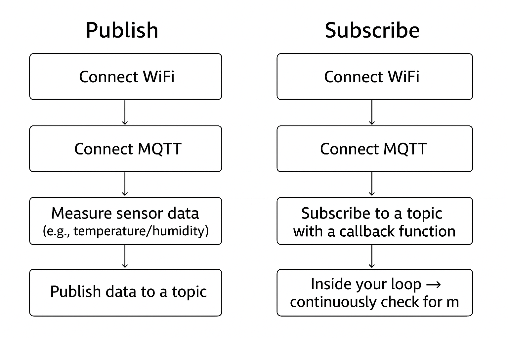

Perfect 👍
Your README looks **clean and clear** — just missing a **dedicated section for HiveMQ Cloud (TLS, port 8883)** since you already built the `HiveMQHandler` class. I’ll suggest a **modified version** of your README that includes both **simple MQTT (1883)** and **HiveMQ Cloud (8883 + TLS)**, so users can choose based on their broker.

Here’s the updated version:

---

# 📡 MQTTHandler & WiFiHandler for ESP32 (MicroPython)

Simple classes to connect your ESP32 to **WiFi** and an **MQTT broker**, publish sensor data, and receive messages.
Supports both **public non-secure brokers** and **HiveMQ Cloud (TLS 8883)**.

---

## 🛠 Steps to Use

### 1️⃣ Import the handler files

Download `wifi_handler.py` and `mqtt_handler.py` (for plain MQTT) or `hivemq_handler.py` (for TLS/HiveMQ) and put them in the **same directory as your `main.py`**.

```python
from wifi_handler import WiFiHandler
from mqtt_handler import MQTTHandler        # For plain MQTT (1883)
from hivemq_handler import HiveMQHandler    # For HiveMQ Cloud (8883 + TLS)
```

---

### 2️⃣ Connect to WiFi

This step establishes your ESP32’s internet connection. Without it, MQTT won’t work.

```python
wifi = WiFiHandler("YourWiFiSSID", "YourWiFiPassword")
wifi.connect()
```

Output:

```
✅ WiFi Connected: ('192.168.1.50', '255.255.255.0', '192.168.1.1', '8.8.8.8')
```

---

### 3️⃣ Define your MQTT parameters

#### 🔹 For public brokers (non-TLS, port **1883**):

```python
MQTT_CLIENT_ID = "esp32-demo"
MQTT_BROKER    = "mqtt-dashboard.com"
MQTT_USER      = ""        # not required
MQTT_PASSWORD  = ""        # not required
MQTT_TOPIC     = b"esp32/test"
```

#### 🔹 For HiveMQ Cloud (TLS, port **8883**):

```python
MQTT_CLIENT_ID = "esp32-demo" 
MQTT_BROKER    = "f446739580a645d9b26dc12166f78ed8.s1.eu.hivemq.cloud"     #your server URL
MQTT_USER      = "your-hivemq-username"
MQTT_PASSWORD  = "your-hivemq-password"
MQTT_TOPIC     = b"esp32/test"
PORT = 8883 #oe your server port number
```

---

### 4️⃣ Create and connect the MQTT client

#### Public broker (1883):

```python
mqtt_client = MQTTHandler(MQTT_CLIENT_ID, MQTT_BROKER, MQTT_USER, MQTT_PASSWORD)
mqtt_client.connect()
```

#### HiveMQ Cloud (8883 + TLS):

```python
mqtt_client = HiveMQHandler(MQTT_CLIENT_ID, MQTT_BROKER, MQTT_USER, MQTT_PASSWORD, PORT)
mqtt_client.connect()
```

---

### 5️⃣ Publish a message

```python
mqtt_client.publish(MQTT_TOPIC, "Hello from ESP32")
```

---

### 6️⃣ Subscribe to a topic

```python
def message_callback(topic, msg):
    print(f"📩 Received on {topic.decode()}: {msg.decode()}")

mqtt_client.subscribe(MQTT_TOPIC, message_callback)
```

---

### 7️⃣ Check messages in the main loop

```python
while True:
  try:
    mqtt_client.check_messages()
  except OSError as e:
    print(f "Error {e}")
```

---

## ✅ Features

* Easy WiFi connection
* MQTT connect, publish, and subscribe
* Callback for received messages
* Non-blocking message checking
* `umqtt.robust` → auto-reconnect if disconnected
* TLS/SSL support for HiveMQ Cloud

---

## 📊 Workflow Diagram



---

⚠️ **Important Notes:**

* Use **port 1883** for public brokers (`mqtt-dashboard.com`, `test.mosquitto.org`).
* Use **port 8883 (TLS)** with username/password for **HiveMQ Cloud**.
* For production, prefer **`umqtt.robust`** since it automatically reconnects if WiFi or MQTT connection drops.

---

👉 See `main.py` for complete examples with both **simple MQTT** in **main_simple.py**and **HiveMQ Cloud (TLS)** in **main.robust**.

---
